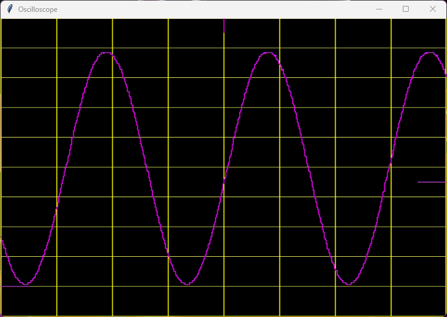

<!---

This file is used to generate your project datasheet. Please fill in the information below and delete any unused
sections.

You can also include images in this folder and reference them in the markdown. Each image must be less than
512 kb in size, and the combined size of all images must be less than 1 MB.
-->

## How it works

This is an basic oscilloscope design using the experimental VHDL template. Using one channel of an ADC Pmod (PmodAD1) and an external FRAM to sample and buffer the data, an DAC Pmod (PmodDA2) to generate various test signals, an HDMI Pmod to display the data and four buttons & two switches to control the oscilloscope.

When the trigger-button is pressed, a single-shot measurement is taken when the trigger criteria is met. The trigger criteria can be the vertical and horizontal position as well as the trigger level (pos-edge or neg-edge). The data is buffered onto the external FRAM, with the goal to contain 32k samples before the trigger event and 32k samples after the trigger event. After the data is collected, the data is displayed on the HDMI screen.

Since an external FRAM memory is used with no buffers on the chip, the screen is actually tilted to the right by 90 degrees. This causes the image to build up not from the top to the bottom, but from the left to the right, rendering only one sample per x-axis pixel. Using this screen orientation allows the blanking time to be used to pull the next sample from the FRAM, which is then displayed on the screen. A [python script](show_scope.py) is used to read an external HDMI capture card, rotate the image by 90 degrees and display it on the screen.

The signal generator supports a few basic waveforms: sine, square, triangle and sawtooth. The frequency and amplitude can be adjusted using the buttons and switches at the cost of the resolution of the signal. The signal generator is also used to test the trigger functionality and the display of the oscilloscope.

In addition to see what settings have currently been selected, they are also transmitted via UART at 9600 baud (8N1) at uo_out(3).

## How to test

Connect the various Pmods to the TinyTapeout or FPGA board according to the (pinout description in the info.yaml file)[../info.yaml]. Connect the output of the DAC to the input of the ADC and connect the HDMI Pmod to a screen or HDMI capture card. Run the trigger to capture a single-shot measurement and display the data on the screen.

## External hardware

To test and use this project, you will need the following hardware:
 - (A 3-bit HDMI Pmod)[https://blackmesalabs.wordpress.com/2017/12/15/bml-hdmi-video-for-fpgas-over-pmod/]
 - (A 12-bit ADC Pmod)[https://digilent.com/reference/pmod/pmodad1/start]
 - (A 12-bit DAC Pmod)[https://digilent.com/reference/pmod/pmodda2/start]
 - (An external FRAM chip)[https://datasheet.octopart.com/FM25W256-G-Cypress-Semiconductor-datasheet-86779777.pdf]
 - (A Buttons Pmod)[https://digilent.com/reference/pmod/pmodbtn/start]
 - (A Switches Pmod (only first two are used))[https://digilent.com/reference/pmod/pmodswt/start]
 - Optionally, an HDMI capture card to display the HDMI output on a computer screen
